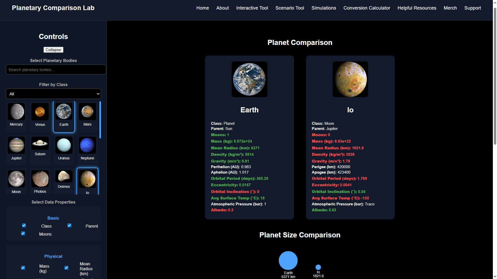
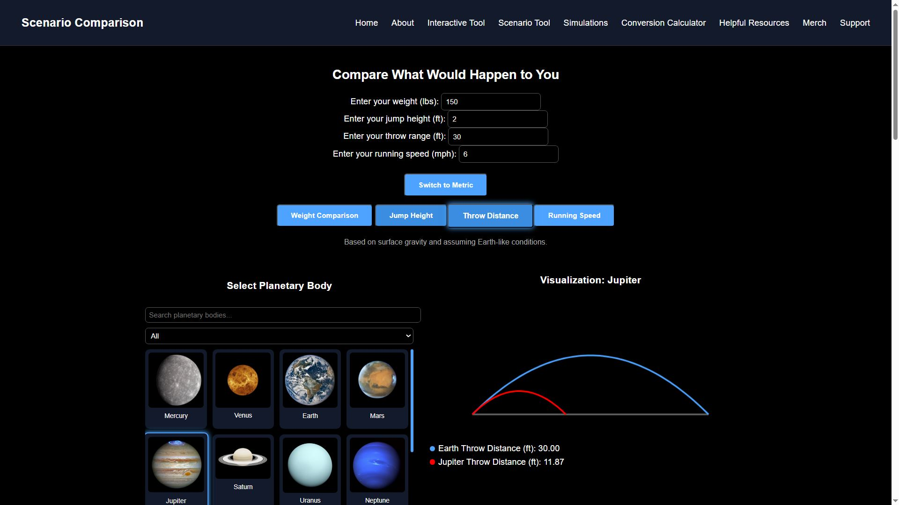
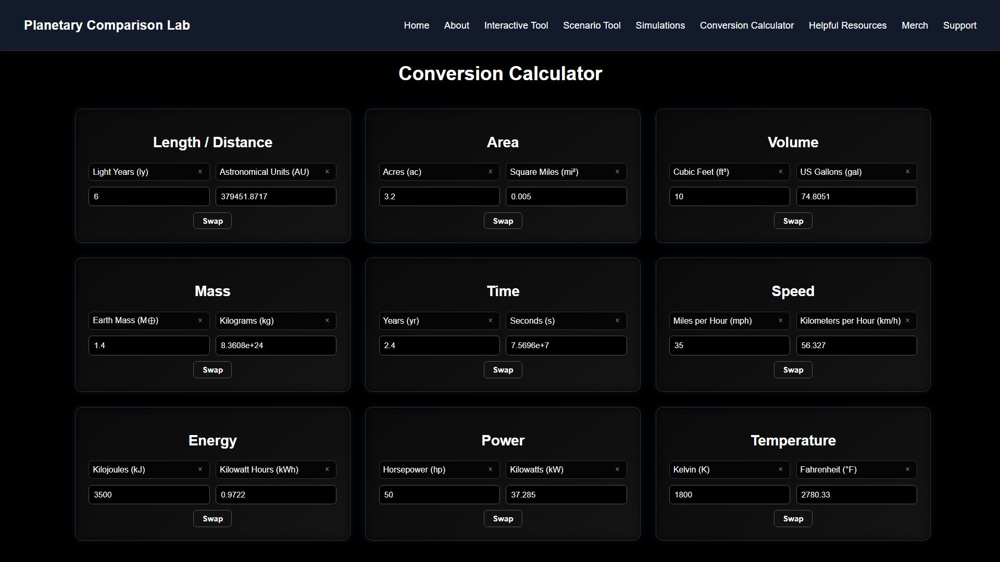

# Planetary Physics Visualization Web App

Interactive web application for exploring physics and planetary science through real-time simulations and data visualization.

---

## Features

### Planetary Comparison Lab
Compares two planetary bodies across categories such as physical, orbital, and environmental/surface characteristics. Includes visual representations and size comparisons.

  

---

### Scenario Comparison Tool
Simulates real-world scenarios (weight, jump height, throw distance, running speed) across different planetary environments with animated visual comparisons and unit switching.

  

---

### Conversion Calculator
Performs unit conversions across multiple categories including length, area, volume, mass, time, speed, energy, power, and temperature.

  

---

## Tech Stack
- Frontend: JavaScript (ES6+), HTML5, CSS3
- Visualization: Canvas API
- Data: JSON-based datasets

---

## Status
Active Development 
(Core functionality implemented; UI and features ongoing refinement)

---

## Run Locally
Open `index.html` in a web browser